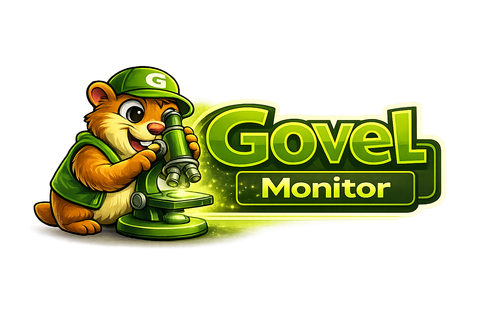

<p align="center">
    
</p>

<p align="center">
    <a href="https://packagist.org/packages/mpge/govel"></a>
    <a href="https://packagist.org/packages/mpge/govel"></a>
    <a href="https://packagist.org/packages/mpge/govel"></a>
    <a href="https://github.com/mpge/govel/actions"></a>
    <a href="https://github.com/mpge/govel/blob/main/LICENSE"></a>
</p>

<p align="center">
    Execute high-performance Go tasks from Laravel as if they were native jobs.<br>
    No extensions. No embedding. Just blazing-fast Go binaries behind a clean Laravel API.
</p>

---

## Why Govel?

Some workloads — image processing, data crunching, cryptography, file parsing — are simply faster in Go. Govel lets you offload these to compiled Go binaries while keeping your application logic in Laravel.

```php
use Mpge\Govel\Facades\Govel;
use App\Tasks\ProcessImage;

// Synchronous
$result = Govel::run(ProcessImage::class, [
    'path' => '/tmp/image.jpg',
    'width' => 800,
]);

// Asynchronous (fire-and-forget)
Govel::dispatch(ProcessImage::class, ['path' => '/tmp/image.jpg']);

// Queue (Laravel queue integration)
Govel::queue(ProcessImage::class, ['path' => '/tmp/image.jpg'])
    ->onQueue('processing')
    ->delay(30);
```

## Requirements

- PHP 8.3+
- Laravel 11+
- Go 1.21+ (for compiling workers)

## Installation

```bash
composer require mpge/govel
```

Publish the config file:

```bash
php artisan vendor:publish --tag=govel-config
```

## Quick Start

Govel provides Artisan commands to scaffold everything you need:

```bash
# 1. Create a task class
php artisan govel:make-task ProcessImage
# → app/Tasks/ProcessImage.php

# 2. Scaffold the Go worker
php artisan govel:make-worker process-image
# → bin/workers/process-image/main.go

# 3. Compile the worker
php artisan govel:build process-image
# → bin/process-image

# 4. Run it
Govel::run(ProcessImage::class, ['path' => '/tmp/photo.jpg']);
```

## Artisan Commands

| Command | Description |
|---|---|
| `govel:make-task {name}` | Scaffold a new Task class at `app/Tasks/{Name}.php` |
| `govel:make-worker {name}` | Scaffold a Go worker with `main.go` and `go.mod` at `bin/workers/{name}/` |
| `govel:build {name?}` | Compile Go workers into binaries. Omit name to build all. |
| `govel:list` | List all available tasks with binary status (found/missing) |

### govel:make-task

```bash
php artisan govel:make-task ResizeImage
```

Generates `app/Tasks/ResizeImage.php`:

```php
namespace App\Tasks;

use Mpge\Govel\Contracts\Task;

class ResizeImage implements Task
{
    public function name(): string
    {
        return 'resize-image';
    }
}
```

### govel:make-worker

```bash
php artisan govel:make-worker resize-image
```

Creates `bin/workers/resize-image/` with a Go template that reads JSON from stdin and writes JSON to stdout.

### govel:build

```bash
# Build a specific worker
php artisan govel:build resize-image

# Build all workers
php artisan govel:build
```

Compiles Go source in `bin/workers/*/` to binaries in `bin/`. Requires Go to be installed.

### govel:list

```bash
php artisan govel:list
```

Outputs a table showing each task name, its binary path, and whether the binary exists.

## Drivers

Govel ships with three drivers. Set `GOVEL_DRIVER` in your `.env`:

| Driver | Use Case | How It Works |
|---|---|---|
| `process` (default) | Simple, single-server | Spawns a Go binary per task via Symfony Process |
| `grpc` | Persistent server, zero startup overhead | HTTP/JSON bridge to a long-running Go server |
| `distributed` | Multi-node, high availability | Load-balanced requests across multiple Go servers |

### Process Driver

The default. Each task spawns a Go binary, communicates via stdin/stdout JSON.

```env
GOVEL_DRIVER=process
GOVEL_BIN_PATH=/path/to/bin
GOVEL_TIMEOUT=30
```

### gRPC Driver

Connects to a persistent Go server — no process startup cost per task. Uses HTTP/JSON (no PHP extensions required).

```env
GOVEL_DRIVER=grpc
GOVEL_GRPC_HOST=127.0.0.1
GOVEL_GRPC_PORT=9800
```

Start the included Go server:

```bash
cd bin/workers/govel-server
go build -o ../../govel-server .
GOVEL_PORT=9800 GOVEL_BIN_PATH=../../ ../../govel-server
```

### Distributed Driver

Load-balances tasks across multiple Govel server nodes with automatic failover.

```php
// config/govel.php
'driver' => 'distributed',
'distributed' => [
    'strategy' => 'round-robin', // or 'least-connections'
    'nodes' => [
        ['host' => '10.0.0.1', 'port' => 9800],
        ['host' => '10.0.0.2', 'port' => 9800],
        ['host' => '10.0.0.3', 'port' => 9800],
    ],
],
```

## Queue Integration

Dispatch Go tasks onto Laravel queues:

```php
// Basic queue dispatch
Govel::queue(ProcessImage::class, ['path' => '/tmp/img.jpg']);

// With options
Govel::queue(ProcessImage::class, $payload)
    ->onQueue('processing')
    ->onConnection('redis')
    ->delay(60)
    ->via('grpc');  // Use a specific Govel driver
```

## Go Worker Contract

Every Go binary must:

1. **Read JSON from stdin** — the payload from PHP
2. **Write JSON to stdout** — the response back to PHP
3. **Exit 0** on success, non-zero on failure
4. **Write errors to stderr** — captured for logging

## Result DTO

```php
$result = Govel::run(ProcessImage::class, $payload);

$result->success;   // bool
$result->output;    // array (decoded JSON from Go)
$result->error;     // string|null
$result->duration;  // float (milliseconds)
```

## Error Handling

```php
use Mpge\Govel\Exceptions\BinaryNotFoundException;
use Mpge\Govel\Exceptions\TaskExecutionException;

try {
    $result = Govel::run(ProcessImage::class, $payload);
} catch (BinaryNotFoundException $e) {
    // Binary not found at expected path
} catch (TaskExecutionException $e) {
    // Process timed out or failed
}

if (! $result->success) {
    logger()->error($result->error);
}
```

## Extending with Custom Drivers

```php
Govel::extend('custom', new MyCustomDriver());
Govel::driver('custom')->run($task, $payload);
```

## Architecture

```
Laravel (PHP)
  → Govel Facade
    → GoManager
      ├── ProcessDriver  → Go binary (stdin/stdout)
      ├── GrpcDriver     → Go HTTP server (persistent)
      └── DistributedDriver → Multiple Go servers (load balanced)
          → Result DTO
```

## Configuration Reference

```php
// config/govel.php
return [
    'driver'  => env('GOVEL_DRIVER', 'process'),
    'bin_path' => env('GOVEL_BIN_PATH', base_path('bin')),
    'timeout'  => env('GOVEL_TIMEOUT', 30),

    'grpc' => [
        'host' => env('GOVEL_GRPC_HOST', '127.0.0.1'),
        'port' => env('GOVEL_GRPC_PORT', 9800),
        'tls'  => env('GOVEL_GRPC_TLS', false),
    ],

    'distributed' => [
        'strategy' => env('GOVEL_DIST_STRATEGY', 'round-robin'),
        'tls'      => env('GOVEL_DIST_TLS', false),
        'nodes'    => [],
    ],

    'queue' => [
        'connection' => env('GOVEL_QUEUE_CONNECTION'),
        'queue'      => env('GOVEL_QUEUE_NAME', 'govel'),
    ],
];
```

## Govel Monitor

<p align="center">
    <a href="https://github.com/mpge/govel-monitor">
        
    </a>
</p>

Track every Go task execution with a real-time dashboard. Zero code changes — just install and go.

```bash
composer require mpge/govel-monitor
php artisan migrate
```

Visit `/govel-monitor` to see your dashboard. [Learn more →](https://github.com/mpge/govel-monitor)

## License

The MIT License (MIT). Please see [License File](LICENSE) for more information.
