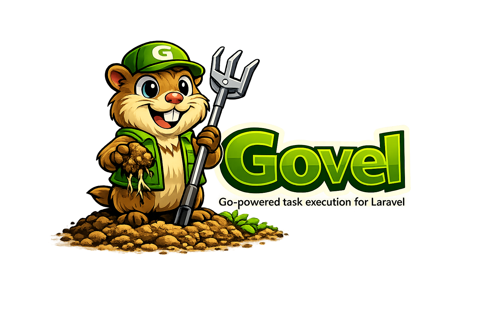

<p align="center">
    
</p>

<p align="center">
    <a href="https://packagist.org/packages/mpge/govel"></a>
    <a href="https://packagist.org/packages/mpge/govel"></a>
    <a href="https://packagist.org/packages/mpge/govel"></a>
    <a href="https://github.com/mpge/govel/blob/main/LICENSE"></a>
</p>

<p align="center">
    Execute high-performance Go tasks from Laravel as if they were native jobs.<br>
    No extensions. No embedding. Just blazing-fast Go binaries behind a clean Laravel API.
</p>

---

## Why Govel?

Some workloads — image processing, data crunching, cryptography, file parsing — are simply faster in Go. Govel lets you offload these to compiled Go binaries while keeping your application logic in Laravel.

```php
use Mpge\Govel\Facades\Govel;
use Mpge\Govel\Tasks\ProcessImage;

// Synchronous — blocks until the Go binary returns
$result = Govel::run(ProcessImage::class, [
    'path' => '/tmp/image.jpg',
    'width' => 800,
]);

$result->success;   // true
$result->output;    // ['status' => 'processed', 'format' => 'webp', ...]
$result->duration;  // 52.3 (milliseconds)

// Asynchronous — fire-and-forget
Govel::dispatch(ProcessImage::class, [
    'path' => '/tmp/image.jpg',
]);
```

## Requirements

- PHP 8.3+
- Laravel 11+
- Go 1.21+ (for compiling workers)

## Installation

```bash
composer require mpge/govel
```

Publish the config file:

```bash
php artisan vendor:publish --tag=govel-config
```

## Configuration

`config/govel.php`:

| Key | Default | Description |
|---|---|---|
| `driver` | `process` | Execution driver |
| `bin_path` | `base_path('bin')` | Directory containing compiled Go binaries |
| `timeout` | `30` | Max execution time in seconds |

## Quick Start

### 1. Define a PHP Task

```php
namespace App\Tasks;

use Mpge\Govel\Contracts\Task;

class ProcessImage implements Task
{
    public function name(): string
    {
        return 'process-image';
    }
}
```

The `name()` method maps directly to a binary in your `bin/` directory.

### 2. Write the Go Worker

Create `bin/workers/process-image/main.go`:

```go
package main

import (
    "encoding/json"
    "fmt"
    "io"
    "os"
)

func main() {
    input, _ := io.ReadAll(os.Stdin)

    var payload map[string]interface{}
    json.Unmarshal(input, &payload)

    // Your processing logic here...

    result, _ := json.Marshal(map[string]interface{}{
        "status": "done",
    })
    fmt.Println(string(result))
}
```

### 3. Compile

```bash
cd bin/workers/process-image
go build -o ../../process-image .
```

### 4. Run

```php
$result = Govel::run(ProcessImage::class, ['path' => '/tmp/photo.jpg']);
```

## Go Worker Contract

Every Go binary must:

1. **Read JSON from stdin** — the payload from PHP
2. **Write JSON to stdout** — the response back to PHP
3. **Exit 0** on success, non-zero on failure
4. **Write errors to stderr** — captured for logging

## Result DTO

`Govel::run()` returns an immutable `Result` object:

```php
$result->success;   // bool
$result->output;    // array (decoded JSON from Go)
$result->error;     // string|null
$result->duration;  // float (milliseconds)
```

## Error Handling

```php
use Mpge\Govel\Exceptions\BinaryNotFoundException;
use Mpge\Govel\Exceptions\TaskExecutionException;

try {
    $result = Govel::run(ProcessImage::class, $payload);
} catch (BinaryNotFoundException $e) {
    // Binary not found at expected path
} catch (TaskExecutionException $e) {
    // Process timed out or failed
}

// Non-critical failures return in the Result:
if (! $result->success) {
    logger()->error($result->error);
}
```

## Extending with Custom Drivers

Govel is built for extensibility. Register your own drivers:

```php
Govel::extend('grpc', new GrpcDriver(/* ... */));

// Then use it:
Govel::driver('grpc')->run($task, $payload);
```

## Architecture

```
Laravel (PHP)
  → Govel Facade
    → GoManager (resolves driver)
      → ProcessDriver (Symfony Process)
        → Go binary (stdin/stdout JSON)
          → Result DTO
```

## Roadmap

- [ ] gRPC driver
- [ ] Queue integration
- [ ] Distributed workers
- [ ] Horizon-style dashboard

## License

The MIT License (MIT). Please see [License File](LICENSE) for more information.
